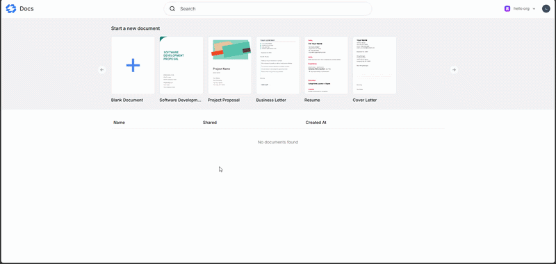

# Docs

A real-time collaborative document editor that allows users to create, edit, and manage rich text documents seamlessly. Built for teams and individuals who need a fast, responsive, and organized workspace for their notes and projects.

🔗 **Live Demo:** [https://portfolio-docs-app.vercel.app](https://portfolio-docs-app.vercel.app)  
🌐 **Portfolio:** [https://aymenghris.vercel.app](https://aymenghris.vercel.app)  

## 📸 Preview 
  

## ✨ Key Features 
- Real-time Collaboration: Edit documents simultaneously with others, complete with live cursors, avatars, and real-time syncing.
- Rich Text Editing: Advanced text formatting using Tiptap, including custom extensions, text highlights, tables, and resizable images.
- Document Management: Create documents from templates, search, rename, delete, and paginate through your workspace.

## 🛠 Tech Stack 
- Frontend: `React` `Next.js` `Tailwind CSS` `Tiptap` `shadcn/ui` `Zustand`
- Backend/Services: `Convex` `Liveblocks` `Clerk`
- Deployment: `Vercel`

## 💡 What I Learned 
- The concept of a real-time database, how to use Convex, and how to seamlessly integrate it with Clerk authentication.
- How JSON Web Tokens (JWT) work for secure user authentication.
- How to structure and organize code effectively for better readability and maintainability.
- What debouncing is and how to implement it properly in React applications.
- How to use the Tiptap rich-text editor, leverage its extensions, and create custom extensions.
- How to use shadcn/ui and fully customize its components to match the design system.
- How to implement global state management cleanly using Zustand.

## 👤 Contact 
[LinkedIn](https://linkedin.com/in/aymenghris) • [Email](mailto:aymenghris@outlook.com) • [GitHub](https://github.com/aymenghris)